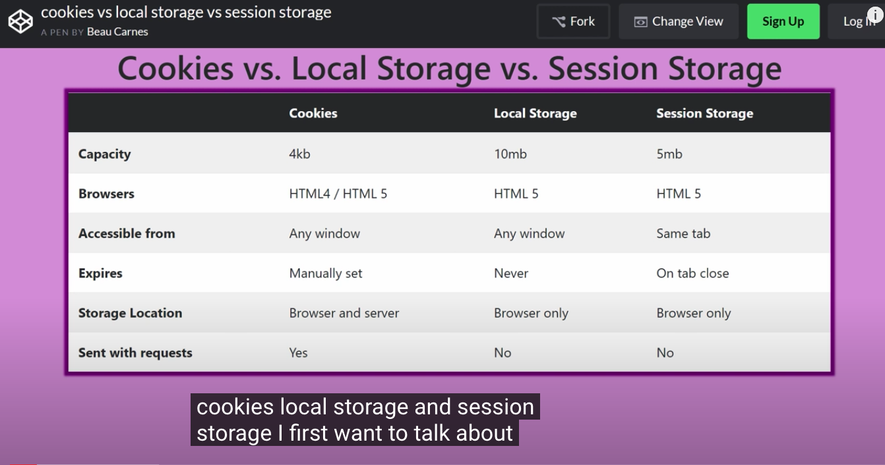

### Cookies, Sessions, and local storage 
Cookies and Sessions are used to store information. Cookies are only stored on the client-side machine, while sessions get stored on the client as well as a server. 

- Cookies sent with requests, why it is so small capacity; otherwise, it slows down the whole process. 

### Session

- A session creates a file in a temporary directory on the server where registered session variables and their values are stored. This data will be available to all pages on the site during that visit.A session ends when the user closes the browser or after leaving the site, the server will terminate the session after a predetermined period of time, commonly 30 minutes duration.

1. Why do we want sessions?
- Because HTTP is stateless, in order to associate a request to any other request, you need a way to store user data between HTTP requests.

- Cookies or URL parameters ( for ex. like http://example.com/myPage?asd=lol&boo=no ) are both suitable ways to transport data between 2 or more request. However they are not good in case you don't want that data to be readable/editable on client side.The solution is to store that data server side, give it an "id", and let the client only know (and pass back at every http request) that id. There you go, sessions implemented. Or you can use the client as a convenient remote storage, but you would encrypt the data and keep the secret server-side.Of course there are other aspects to consider, like you don't want people to hijack other's sessions, you want sessions to not last forever but to expire, and so on.In your specific example, the user id (could be username or another unique ID in your user database) is stored in the session data, server-side, after successful identification. Then for every HTTP request you get from the client, the session id (given by the client) will point you to the correct session data (stored by the server) that contains the authenticated user id - that way your code will know what user it is talking to.

### Exampple Log in Cookie
Step 1: Client > Signing up

Before anything else, the user has to sign up. The client posts a HTTP request to the server containing his/her username and password.

Step 2: Server > Handling sign up

The server receives this request and hashes the password before storing the username and password in your database. This way, if someone gains access to your database they won't see your users' actual passwords.

Step 3: Client > User login

Now your user logs in. He/she provides their username/password and again, this is posted as a HTTP request to the server.

Step 4: Server > Validating login

The server looks up the username in the database, hashes the supplied login password, and compares it to the previously hashed password in the database. If it doesn't check out, we may deny them access by sending a 401 status code and ending the request.

Step 5: Server > Generating access token

If everything checks out, we're going to create an access token, which uniquely identifies the user's session. Still in the server, we do two things with the access token:

Store it in the database associated with that user
Attach it to a response cookie to be returned to the client. Be sure to set an expiration date/time to limit the user's session
Henceforth, the cookies will be attached to every request (and response) made between the client and server.

Step 6: Client > Making page requests

Back on the client side, we are now logged in. Every time the client makes a request for a page that requires authorization (i.e. they need to be logged in), the server obtains the access token from the cookie and checks it against the one in the database associated with that user. If it checks out, access is granted.